

  

    <h2 class="ps-profile-name">m0NESY ⓘ</h2>
    

      

战队

<a href="#">Falcons Esports</a> 🦅

      

国籍

俄罗斯 🇷🇺

      

姓名

Ilya Osipov

      

生日

2005 年 5 月 1 日

    

    
Ilya「m0NESY」Osipov 是一名俄罗斯职业《反恐精英 2》选手，目前效力于 Falcons Esports，司职 AWPer（狙击手）。他出生于 2005 年 5 月 1 日，被许多人认为是 CS 最具天赋的选手之一。14 岁时便受邀加入 FPL（FACEIT 最高级别娱乐局联赛，职业哥在此打路人局）。

  

CS2 游戏设置

  
🖱️ 鼠标

  
Logitech G Pro X Superlight 2 White

  

    

DPI

400

    

灵敏度

2.3

    

eDPI

920

    

开镜灵敏度

1

    

回报率

2000 Hz

    

Windows 灵敏度

6

  

  
⊕ 准星

  

    

      
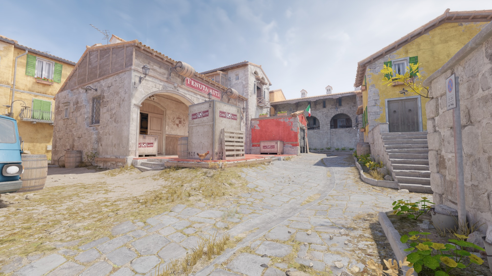

      
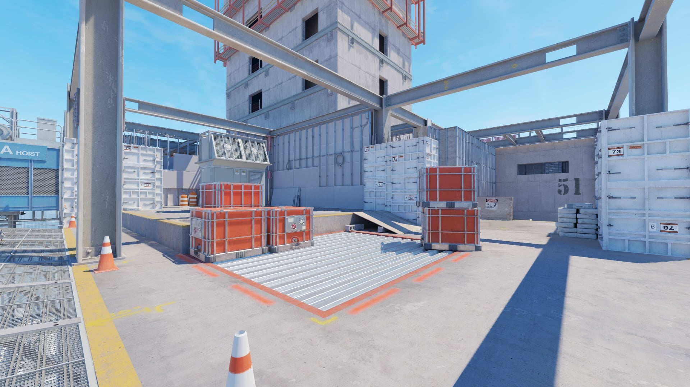

      
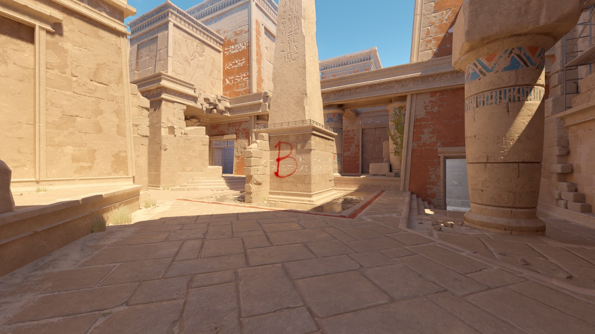

      
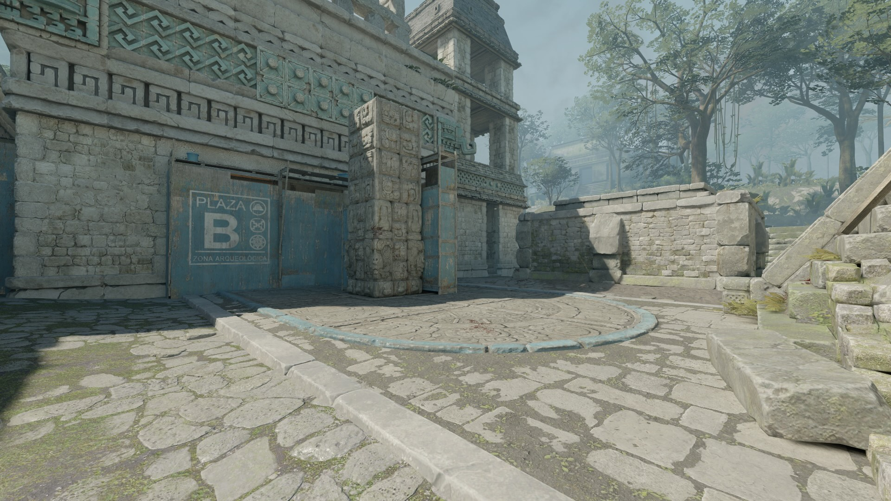

      
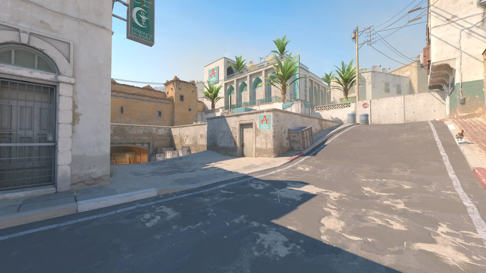

      
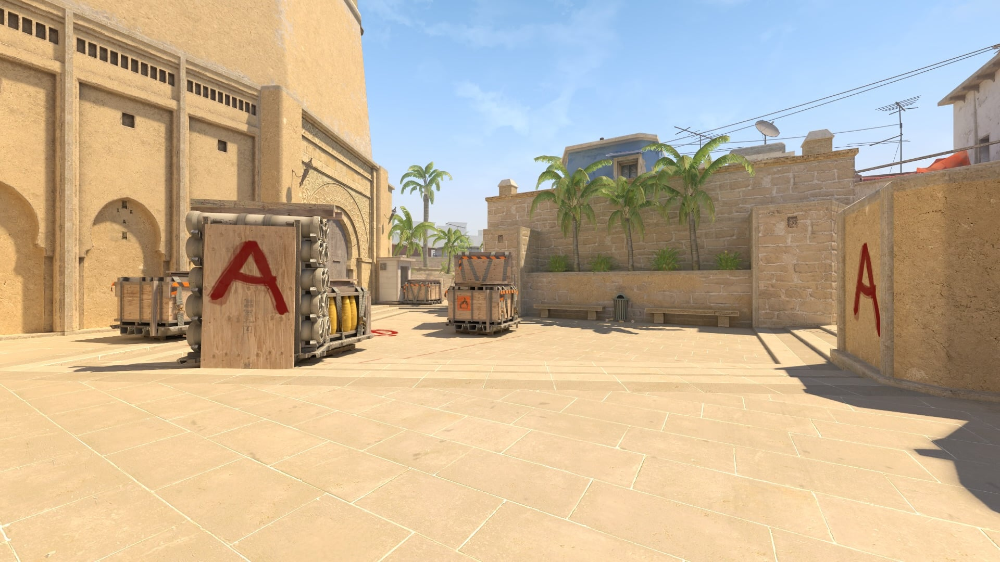

      
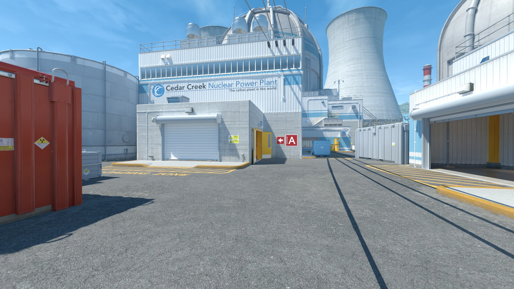

      
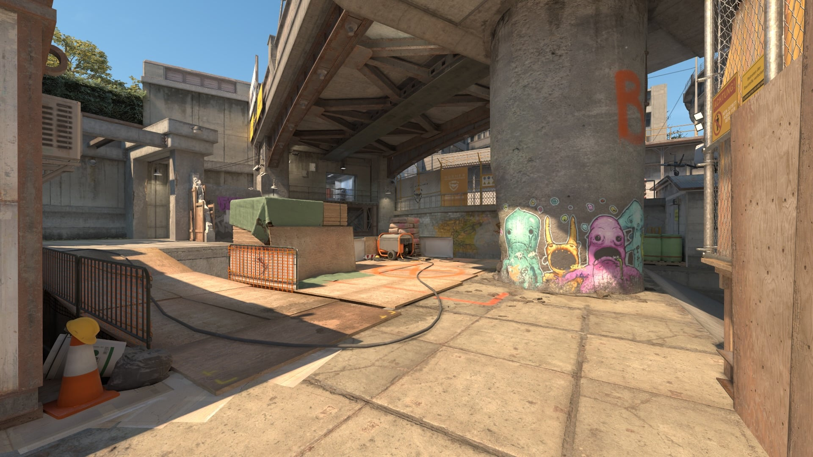

    

    

      <svg xmlns="http://www.w3.org/2000/svg" width="50" height="50" viewBox="0 0 50 50">
        <rect x="26" y="24" width="2" height="2" fill="rgb(0,255,255)" fill-opacity="1"/>
        <rect x="22" y="24" width="2" height="2" fill="rgb(0,255,255)" fill-opacity="1"/>
        <rect x="24" y="22" width="2" height="2" fill="rgb(0,255,255)" fill-opacity="1"/>
        <rect x="24" y="26" width="2" height="2" fill="rgb(0,255,255)" fill-opacity="1"/>
      </svg>
    

    <button type="button" class="ps-crosshair-arrow ps-crosshair-arrow--prev" aria-label="上一张">&#8249;</button>
    <button type="button" class="ps-crosshair-arrow ps-crosshair-arrow--next" aria-label="下一张">&#8250;</button>
    

  

  

    

样式

经典静态

    

跟随后坐力

否

    

中心点

否

    

长度

1

    

厚度

1

    

间隙

-4

    

轮廓

否

    

颜色

青色

    

红

0

    

绿

255

    

蓝

170

    

透明度

是

    

T 型准星

否

    

持枪间隙

否

    

狙击镜线宽

0

  

  
CSGO-wAD3c-ykt5L-zvZ98-vBisR-6sWPA

  
◎ 视频设置

  
视频

  

    

分辨率

1280×960

    

宽高比

4:3

    

缩放模式

拉伸

    

亮度

93%

    

显示模式

全屏

  

  

  
高级视频

  

    

提升玩家对比度

已启用

    

垂直同步

已禁用

    

NVIDIA Reflex 低延迟

已禁用

    

NVIDIA G-Sync

已禁用

    

游戏内最大 FPS

999

    

多重采样抗锯齿

8x MSAA

    

全局阴影质量

高

    

动态阴影

全部

    

模型/纹理细节

低

    

纹理过滤模式

双线性

    

着色器细节

低

    

粒子细节

低

    

环境光遮蔽

已禁用

    

高动态范围

品质

    

FidelityFX 超分辨率

已禁用（最高品质）

  

  
🎮 外设

  

  

    

显示器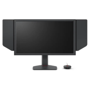

ZOWIE XL2586X+

    

鼠标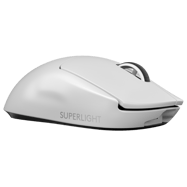

Logitech G Pro X Superlight 2 White

    

键盘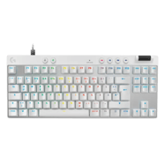

Logitech G Pro X TKL RAPID White

    

耳机

Logitech G Pro X Headset

    

鼠标垫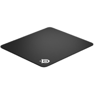

SteelSeries QcK Heavy

    

入耳式耳机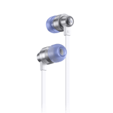

Logitech G333 White

  

  
🔪 饰品

  

  

    

匕首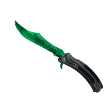

★ 蝴蝶刀 | 伽玛多普勒（绿宝石） 崭新出厂

    

手套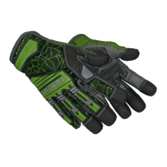

★ 专业手套 | 翠绿之网 略有磨损

    

步枪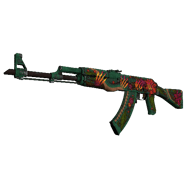

AK-47 | 野荷 久经沙场

    

步枪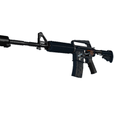

M4A1-S | 守护者 崭新出厂

    

狙击枪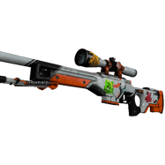

StatTrak™ AWP | 二西莫夫 战痕累累

    

手枪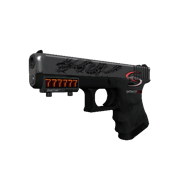

Glock-18 | 龙纹身 崭新出厂

    

手枪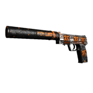

StatTrak™ USP-S | 猎户座 崭新出厂

    

手枪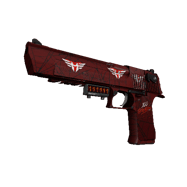

StatTrak™ 沙漠之鹰 | 深红之网 略有磨损

  

