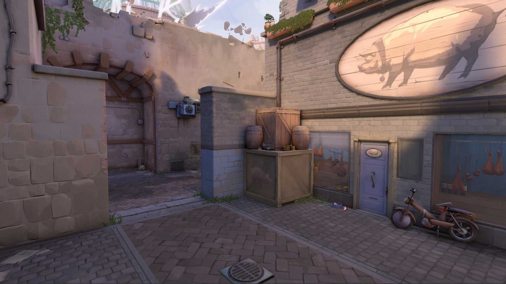
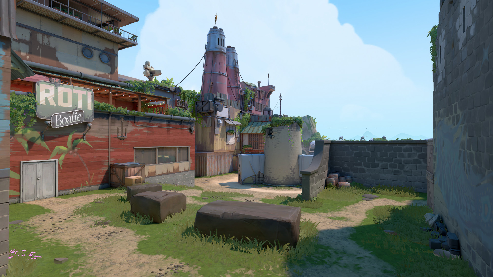
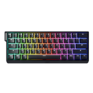
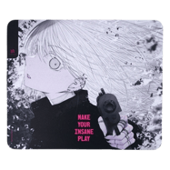
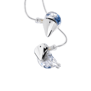

  

    <h2 class="ps-profile-name">ZmjjKK ⓘ</h2>
    

      

战队

<a href="#">Edward Gaming</a> 🇨🇳

      

国籍

中国 🇨🇳

      

姓名

郑永康

      

生日

2004 年 3 月 3 日

    

    
郑永康「ZmjjKK」是中国职业 VALORANT 选手，目前效力于 Edward Gaming（EDG），司职决斗（Duelist）。他是 VCT 中国区最具代表性的瞄准手之一，曾随 EDG 夺得 2024 巴黎 Masters 世界冠军。

  

VALORANT 游戏设置

  
🖱️ 鼠标

  
VAXEE NP-01S V3 Black

  

    

DPI

1600

    

灵敏度

0.1

    

eDPI

160

    

开镜灵敏度

1.3

    

ADS 灵敏度

0.9

    

回报率

4000 Hz

    

Windows 灵敏度

6

    

Raw Input Buffer

开启

  

  
⊕ 准星

  

    

      

      

      

      

      

      

    

    <button type="button" class="ps-crosshair-arrow ps-crosshair-arrow--prev" aria-label="上一张">&#8249;</button>
    <button type="button" class="ps-crosshair-arrow ps-crosshair-arrow--next" aria-label="下一张">&#8250;</button>
    

  

  

    

颜色

白色

    

准星颜色

Unknown

    

轮廓

关闭

    

轮廓透明度

0.5

    

轮廓厚度

1

    

中心点

开启

    

中心点透明度

1

    

中心点厚度

2

    

显示内线

开启

    

显示外线

关闭

  

  
0;P;h;0;d;1;f;0;0l;2;0v;2;0g;1;0o;1;0f;0;1b;0

  
🎮 外设

  

  

    

显示器

ZOWIE XL2566X+

    

鼠标

VAXEE NP-01S V3 Black

    

键盘

Wooting 60HE+

    

耳机

HyperX Cloud III Wireless

    

鼠标垫

VAXEE PA INSANE

    

入耳式耳机

Moondrop Blessing 3

  

